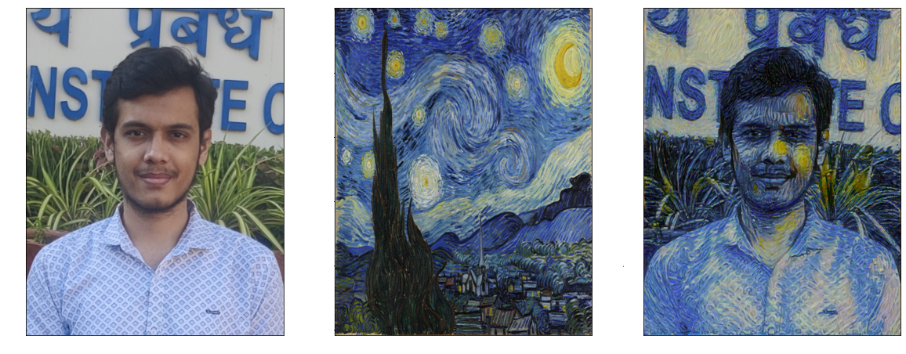

# Neural Style Transfer Project

## Table of Contents
- [Author](#author)
- [Overview](#overview)
- [Key Steps](#key-steps)
- [Results](#results)
- [Additional Information](#additional-information)

## Author
- **Name:** Ronit Singhal
- **Roll Number:** 20NA10033
- **College:** Indian Institute of Technology Kharagpur (IIT KGP)

## Overview

Neural Style Transfer involves combining the content of one image with the style of another. This project provides an implementation of the technique using a pre-trained VGG19 neural network. The steps include loading images, defining style weights, optimizing and evaluating a target image to achieve the desired stylised output.

## Key Steps

1. **Library Setup:**
   Import essential libraries such as PyTorch, Matplotlib, and PIL.

2. **Model Initialization:**
   Load the pre-trained VGG19 model, setting parameters as non-trainable.

3. **Image Preprocessing:**
   Load content and style images, applying necessary transformations.

4. **Feature Extraction:**
   Extract content and style features from the input images using Gram Matrix.

5. **Optimization:**
   Utilise Adam optimizer to iteratively update a target image, balancing content and style.

6. **Evaluation:**
   Display the stylised image and total loss at regular intervals during optimization.

## Results

Check out the stylised images in the notebook to witness the transformation and see how the model combines content and style, creating visually stunning outputs.

## Additional Information

- For more details on the underlying neural style transfer technique, refer to the [original paper](https://www.cv-foundation.org/openaccess/content_cvpr_2016/papers/Gatys_Image_Style_Transfer_CVPR_2016_paper.pdf).

Unleashing creativity with Neural Style Transfer! 🚀